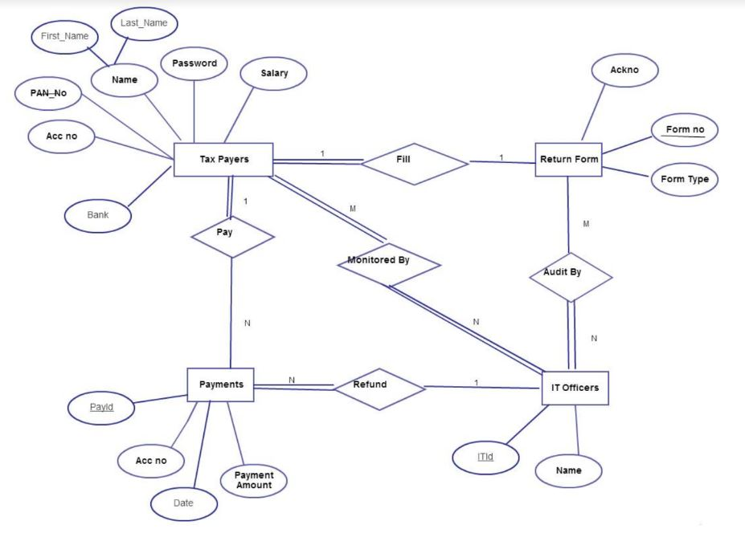

# Income Tax Returns Processing Made Easy

A personal or individual income tax is levied as a percentage of a person’s wages and salaries, with some deductions permitted, along with the net income or loss from businesses and investments. It is typically collected on a pay-as-you-earn basis, with correction at the end of the year for over payments and under payments. This application is created to fulfil includes income from salary/pension or who is carrying out a proprietary business or profession.

This online income tax return filing system would be beneficial and easy to use then typically paper based tax return filing system. Electronic data processing system for preparation of electronically filled tax returns, authorization and payment of refunds based on the data supplied in those returns. As early as the day after completion of the tax return, the tax filler receives initial refund payment from the account. The authorized credit institution electronically files the electronic tax return with the tax collecting authority which processes the return and transfers by electronic fund transfer, the refund amount to the user’s account at the authorized credit institution. Any refund in excess of the initial refund payment is then forwarded to the tax filer.

## Entity Relationship Diagram

